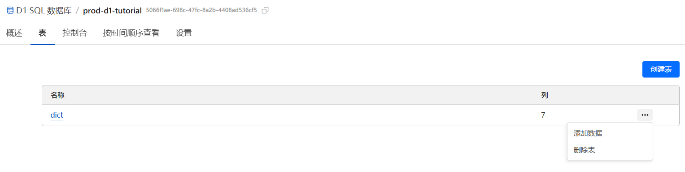

<div align="center">

</div>

# MC模组翻译参考词典

## 关于本项目

为了适应 CFPA 团队翻译数据的不断更新扩充及原[MC百科](https://dict.mcmod.cn/)的数据更新缓慢，页面使用不便的问题，
本项目以MC百科版的功能和页面为参照，做出了开源网页版本。目前大部分功能都已实现完成，更多功能待未来补充。

欢迎各路大佬高手为本项目提出建议和意见，或参与贡献！

## 功能特色

- 智能搜索，搜索结果按照输入匹配度排序
- 智能合并，智能识别同一模组的不同版本译文并统一展示
- 自动分页，一页50条结果，网页下方支持快速跳转首页/尾页
- 记录键名，鼠标悬停在`所属模组`条目上方会显示译文对应的键名
- 及时更新的数据源
- 现代化的页面，支持暗色模式

## 技术细节

本项目网站关于部署及注意事项均在下面列出，供有兴趣的开发者搭建自己的版本。

### 前端

前端为纯html js css内容，本项目将其托管在了Vercel上并连接了Github仓库，仓库推送更新自动同步项目页面。

注意在`public/script.js`里替换为你部署的api地址。

### 后端

所需环境：NodeJS

本项目所用后端数据库和API分别部署在CloudFlare的D1 SQL数据库和Worker上，
然而D1数据库并不支持 [i18n-dict](https://github.com/CFPATools/i18n-dict) 项目
中的sqlite3 `.db`格式，所以还需要转换为`.sql`格式。

关于创建worker并链接D1数据库请看[官方教程](https://developers.cloudflare.com/d1/get-started/)，下方仅列出上传数据库处理步骤。

1. 下载原`.db`格式的数据库文件，并在SQLite官网下载[SQLite Tools](https://www.sqlite.org/2025/sqlite-tools-win-x64-3490100.zip)并解压。
2. 打开sqlite3.exe，并输入下面的命令转换格式：

```
sqlite> .open Dict-Sqlite.db
sqlite> .output Dict-Sqlite.sql
sqlite> .dump
sqlite> .exit
```

3. 然后用文本编辑器（推荐VSCode）打开`Dict-Sqlite.sql`，删除第二行和最后一行：

```sql
BEGIN TRANSACTION;
...
COMMIT;
```

4. 最后在本地终端输入

```cmd
npx wrangler d1 execute prod-d1-tutorial --remote --file=./Dict-Sqlite.sql
```

### 更新数据库方法：

浏览器进入存放词典数据的CloudFlare D1数据库，并删除整个`dict`表。之后方法同上。



## 版权归属

本项目代码部分使用[GPL3协议](LICENSE.md)。
[](LICENSE.md)

本项目数据库来自 CFPATools 的 [i18n-dict](https://github.com/CFPATools/i18n-dict) 项目，翻译数据归属 CFPA 团队及其他译者 ，该作品采用 CC BY-NC-SA 4.0 授权。

## 未实现功能

欢迎各位大佬参与贡献！

- [ ] CurseForge模组跳转
- [ ] 更好的搜索呈现
- [ ] 中英互查
